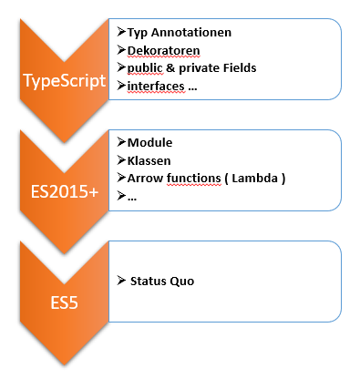
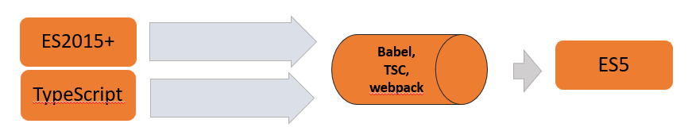

<link rel="stylesheet" href="slides.css">

# TYPESCRIPT #

ppedv AG, Vadzim Naumchyk


<!--  -->

<!-- todo #1 -->

<article>

## INHALT ##

[getting started](#getting-started)

[ecosystem](#ts--ecosystem)

[types](#types)

[functions](#functions)

[data structures](#data-structures)

[interfaces](#interfaces)

[classes](#classes)

[generics](#generics)

[decorators](#decorators)

[scopes](#scopes)

[facts](#facts)

[anhang](#anhang)

</article>

<!-- ||||||||||||||||||||||||||||||||||||||||||||||||||||||||||||| -->
<!-- ||||||||||||||||||||||||||||||||||||||||||||||||||||||||||||| -->
<!-- ||||||||||||||||||||||||||||||||||||||||||||||||||||||||||||| -->
<!-- ||||||||||||||||||||||||||||||||||||||||||||||||||||||||||||| -->
<!-- ||||||||||||||||||||||||||||||||||||||||||||||||||||||||||||| -->

<section class="page">

<!-- ||||||||||||||||||||||||||||||||||||||||||||||||||||||||||||| -->

<article>

---

## GETTING STARTED ##

</article>

<!-- ||||||||||||||||||||||||||||||||||||||||||||||||||||||||||||| -->

<article>

---

### #TYPESCRIPT > IDEA ###

'#ts'

WAS IST TS

- eine Programmiersprache
- Obermenge von JavaScript
- aktuelle Version 4.0.5 (27.10.2020) [#checkForUpdates](https://github.com/microsoft/TypeScript/releases)

WOZU IST TS

- um Fehler abzufangen (durch Typisierung und Code-Analyse-Tools)
- um Code-Patterns besser umzusetzen
- um schneller zu programmieren
- um schneller zu debuggen
- um Interfaces nutzen zu können
- andere Erweiterungen

<!-- todo #2 -->

</article>

<!-- ||||||||||||||||||||||||||||||||||||||||||||||||||||||||||||| -->

<article>

---

### STARTING LINKS ###

OFFIZIELLE QUELLEN

- HOMEPAGE <https://www.typescriptlang.org/>
- DOCS <https://www.typescriptlang.org/docs/home.html>
- CODE <https://github.com/microsoft/TypeScript>
- BLOG <https://devblogs.microsoft.com/typescript/>

<!-- todo #3 -->

</article>

<!-- ||||||||||||||||||||||||||||||||||||||||||||||||||||||||||||| -->

<article>

---

### STARTING TOOLS ###

- Visual Studio Code (VSC)
- nodejs & npmjs (npm i -g typescript)
- TypeScript Compiler tsc (tsc yourfile.ts)
- VSC Erweiterungen
  - TSLint / ESLint (muss für TS noch eingestellt werden)
  - open in browser
  - live server (auto update im Browser bei Änderungen in HTML,JS oder CSS)
  - JavaScript Snippets
  - auto rename tag von Jun Han

<!-- todo #4 -->

</article>

<!-- ||||||||||||||||||||||||||||||||||||||||||||||||||||||||||||| -->

<article>

---

### TS INSTALL ###

```bash
npm install –g typescript
npm init –y (oder strg ö) //für package.json
npm install @types/node -save-dev
```

tsconfig.json anlegen mit

```json
{
    "compilerOptions": {
        "module": "commonjs",
        "sourceMap": true,
        "watch": true
    }
}
```

<!-- todo #5 -->

TS UPDATE

```bash
npm install -g typescript@latest
```

</article>

<!-- ||||||||||||||||||||||||||||||||||||||||||||||||||||||||||||| -->

<article>

---

### TS USE ###

TS TO JS

1. um ein TS-Projekt mit tsconfig.json zu initializieren

```bash
tsc --init
```

2. ts-Datei anlegen mit gewünschtem Code
3. im Terminal `tsc dateiname.ts` oder in ts-Datei `strg shift b` – Datei builden
4. die erstellte js-Datei darf jetzt in html verlinkt werden

</article>

<!-- ||||||||||||||||||||||||||||||||||||||||||||||||||||||||||||| -->

<article>

---

[zurück zu ABLAUF.md](ABLAUF.md#m001--getting-started)

</article>

</section>

<!-- ||||||||||||||||||||||||||||||||||||||||||||||||||||||||||||| -->
<!-- ||||||||||||||||||||||||||||||||||||||||||||||||||||||||||||| -->
<!-- ||||||||||||||||||||||||||||||||||||||||||||||||||||||||||||| -->
<!-- ||||||||||||||||||||||||||||||||||||||||||||||||||||||||||||| -->
<!-- ||||||||||||||||||||||||||||||||||||||||||||||||||||||||||||| -->

<section class="page">

<!-- ||||||||||||||||||||||||||||||||||||||||||||||||||||||||||||| -->

<article>

---

## TS > ECOSYSTEM ##

</article>

<!-- ||||||||||||||||||||||||||||||||||||||||||||||||||||||||||||| -->

<article>

---

### JS SUPERSET ###



<!-- todo #6 -->

</article>

<!-- ||||||||||||||||||||||||||||||||||||||||||||||||||||||||||||| -->

<article>

---

### COMPILING ###



</article>

<!-- ||||||||||||||||||||||||||||||||||||||||||||||||||||||||||||| -->

<article>

---

### #TSC > IDEA ###

WAS IST TSC

- ein command line interface Utensil
- tsc: TypeScript Compiler

<!-- todo #7 -->

</article>

<!-- todo #8 -->

<!-- ||||||||||||||||||||||||||||||||||||||||||||||||||||||||||||| -->

<article>

---

### TSCONFIG.JSON ###

WAS WIRD UNTER TSCONFIG GEMEINT

eine .json-Datei mit Konfiguration für den Compiler

Anwesenheit der tsconfig.json-Datei in einem Verzeichnes markiert es als Root von einem TS-Projekt.

COMPILER CONFIGURATION

```json
"compileOnSave": false,
"compilerOptions": {},
"files": [ "core.ts", "types.ts" ],
"include": [ "src/**/*" ],
"exclude": [ "node_modules", "**/*.spec.ts" ]
```

<!-- todo #9 -->

</article>

<!-- ||||||||||||||||||||||||||||||||||||||||||||||||||||||||||||| -->

<article>

---

### COMPILER OPTIONS ###

```json
"compilerOptions": {
    "baseUrl": "./",
    "outDir": "./dist/out-tsc",
    "sourceMap": true,
    "declaration": false,
    "downlevelIteration": true,
    "experimentalDecorators": true,
    "module": "esnext",
    "moduleResolution": "node",
    "noImplicitAny": true,
    "removeComments": true,
    "preserveConstEnums": true,
    "sourceMap": true,
    "importHelpers": true,
    "target": "es2015",
    "typeRoots": [
      "node_modules/@types"
    ],
    "lib": [
      "es2018",
      "dom"
    ]
}
```

<!-- todo #10 -->

</article>

</section>

<!-- todo #11 -->

<!-- ||||||||||||||||||||||||||||||||||||||||||||||||||||||||||||| -->
<!-- ||||||||||||||||||||||||||||||||||||||||||||||||||||||||||||| -->
<!-- ||||||||||||||||||||||||||||||||||||||||||||||||||||||||||||| -->
<!-- ||||||||||||||||||||||||||||||||||||||||||||||||||||||||||||| -->
<!-- ||||||||||||||||||||||||||||||||||||||||||||||||||||||||||||| -->

<section class="page">

<!-- ||||||||||||||||||||||||||||||||||||||||||||||||||||||||||||| -->

<article>

---

## TYPES ##

</article>

<!-- todo #12 -->

<!-- ||||||||||||||||||||||||||||||||||||||||||||||||||||||||||||| -->

<article>

---

### TYPE SYSTEM > INTRO ###

Static Typing

- Datentypen können angegeben werden und unterstützen insbesondere die Entwicklungsumgebung:
  - Auto-Vervollständigung
  - Fehlermeldungen bei nicht passenden Datentypen
- Beim build: TypeScript wird in JavaScript übersetzt, alle Typeninformationen gehen dabei verloren

</article>

<!-- todo #13 -->

<!-- ||||||||||||||||||||||||||||||||||||||||||||||||||||||||||||| -->

<article>

---

### PRIMITIVES ###

same as in JS:

```js
let completed: boolean = false;
let age: number = 32;
let name: string = 'Andreas';
```

<!-- todo #14 -->

</article>

<!-- todo #15 -->

<!-- todo #16 -->

<!-- ||||||||||||||||||||||||||||||||||||||||||||||||||||||||||||| -->

<article>

---

### ANY ###

any: lässt alle Typen zu

```ts
let inputBox: any = document.querySelector('#inputbox');
```

<!-- todo #17 -->

</article>

<!-- ||||||||||||||||||||||||||||||||||||||||||||||||||||||||||||| -->

<article>

---

### VOID ###

- void: umfasst undefined und null
- nützlich in den Funktionen ohne `return` Anweisung

<!-- todo #18 -->

</article>

<!-- todo #19 -->

<!-- todo #20 -->

<!-- ||||||||||||||||||||||||||||||||||||||||||||||||||||||||||||| -->

<article>

---

### UNION TYPE ###

```ts
export type message = string | null | undefined
```

<!-- todo #21 -->

</article>

<!-- ||||||||||||||||||||||||||||||||||||||||||||||||||||||||||||| -->

<article>

---

### TYPE ALIASES ###

```ts
type C = { a: string, b?: number }
function f({ a, b }: C): void {
// ...
}
```

<!-- todo #22 -->

</article>

<!-- todo #23 -->

<!-- ||||||||||||||||||||||||||||||||||||||||||||||||||||||||||||| -->

<article>

---

### TYPE ASSERTION > ANGLE BRACKETS & AS ###

Zwei Wege

1. angle-brackets syntax
2. as-syntax

```ts
// 1.
let someValue: any = "this is a string";
let strLength: number = (<string>someValue).length;
// 2.
let someValue: any = "this is a string";
let strLength: number = (someValue as string).length;
```

<!-- todo #24 -->

</article>

<!-- ||||||||||||||||||||||||||||||||||||||||||||||||||||||||||||| -->

<article>

---

### NON NULLABLE TYPES ###

Normalerweise akzeptieren alle Datentypen in TS neben eigenen Werten noch 'null' und 'undefined'. 
Ist das nicht gewünscht, dann siehe hier:

<https://github.com/Microsoft/TypeScript/pull/7140>

</article>

<!-- todo #25 -->

</section>

<!-- ||||||||||||||||||||||||||||||||||||||||||||||||||||||||||||| -->
<!-- ||||||||||||||||||||||||||||||||||||||||||||||||||||||||||||| -->
<!-- ||||||||||||||||||||||||||||||||||||||||||||||||||||||||||||| -->
<!-- ||||||||||||||||||||||||||||||||||||||||||||||||||||||||||||| -->
<!-- ||||||||||||||||||||||||||||||||||||||||||||||||||||||||||||| -->

<section class="page">

<!-- ||||||||||||||||||||||||||||||||||||||||||||||||||||||||||||| -->

<article>

---

## FUNCTIONS ##

</article>

<!-- ||||||||||||||||||||||||||||||||||||||||||||||||||||||||||||| -->

<article>

---

### RETURNING NO DATA TYPE ###

```ts
function warnUser(): void {
  alert('this is a warning message');
}
```

<!-- todo #26 -->

</article>

<!-- ||||||||||||||||||||||||||||||||||||||||||||||||||||||||||||| -->

<article>

---

### ARGS & RETURN TYPES ###

Wir können Parametertypen und Rückgabetypen angeben

```ts
function repeatString(text: string, times: number): string {
  return ...;
}
```

</article>

<!-- ||||||||||||||||||||||||||||||||||||||||||||||||||||||||||||| -->

<article>

---

### OPT ARGS ###

Optionale Parameter:

```ts
function buildName(
    firstName: string, lastName?: string
): string 
{
  return firstName + ' ' + lastName;
}
```

</article>

<!-- todo #27 -->

</section>

<!-- ||||||||||||||||||||||||||||||||||||||||||||||||||||||||||||| -->
<!-- ||||||||||||||||||||||||||||||||||||||||||||||||||||||||||||| -->
<!-- ||||||||||||||||||||||||||||||||||||||||||||||||||||||||||||| -->
<!-- ||||||||||||||||||||||||||||||||||||||||||||||||||||||||||||| -->
<!-- ||||||||||||||||||||||||||||||||||||||||||||||||||||||||||||| -->

<section class="page">

<!-- ||||||||||||||||||||||||||||||||||||||||||||||||||||||||||||| -->

<article>

---

## DATA STRUCTURES ##

</article>

<!-- ||||||||||||||||||||||||||||||||||||||||||||||||||||||||||||| -->

<article>

---

### OBJECT ###

Beispiele:

```ts
let p: {name: string, age: number} = getPerson();
console.log(p.age);
// oder
interface Person {
  name: string,
  age: number
}
let p: Person = getPerson();
```

<!-- todo #28 -->

</article>

<!-- todo #29 -->

<!-- ||||||||||||||||||||||||||||||||||||||||||||||||||||||||||||| -->

<article>

---

### ARRAYS ###

Beispiele:

```ts
let names: string[] = ['Anna', 'Bernhard', 'Caro'];
let amounts: number[] = [3, 10, 23];
let list: any[] = [1, true, "free"];
// alternative with generic array type
let names: Array<string> = ['Anna', 'Bernhard', 'Caro'];
```

<!-- todo #30 -->

</article>

<!-- ||||||||||||||||||||||||||||||||||||||||||||||||||||||||||||| -->

<article>

---

### OPERATORS > KEYOF ###

- index type query operator
- für jeden Typ T, `keyof T` ist Union von bekannten, öffentlichen Eigenschaftsnamen von T

```ts
interface Car {
manufacturer: string;
model: string;
year: number;
}
let carProps: keyof Car; // the union of ('manufacturer' | 'model' | 'year')
```

<!-- todo #31 -->

</article>

</section>

<!-- ||||||||||||||||||||||||||||||||||||||||||||||||||||||||||||| -->
<!-- ||||||||||||||||||||||||||||||||||||||||||||||||||||||||||||| -->
<!-- ||||||||||||||||||||||||||||||||||||||||||||||||||||||||||||| -->
<!-- ||||||||||||||||||||||||||||||||||||||||||||||||||||||||||||| -->
<!-- ||||||||||||||||||||||||||||||||||||||||||||||||||||||||||||| -->

<section class="page">

<!-- ||||||||||||||||||||||||||||||||||||||||||||||||||||||||||||| -->

<article>

---

## INTERFACES ##

</article>

<!-- ||||||||||||||||||||||||||||||||||||||||||||||||||||||||||||| -->

<article>

---

### #INTERFACE > IDEA ###

WAS IST EIN INTERFACE

WOZU IST EIN INTERFACE

in TS ist es möglich, eine Variable vom angelegten Interface zu deklarieren. Man braucht also keine Klasse, die dieses Interface implementiert
diese Variable ist kompatibel mit Objekten und mit Klassen, die (u.a.) die gleichen Member haben wie das Interface

```ts
interface Person {
	firstName: string;
	lastName: string;
}
function greetUser(person: Person) {
	return "Hello, " + person.firstName + " " + person.lastName;
}
let user = { firstName: "Max", lastName: "Mustermann"};
document.body.textContent = greetUser(user);
```

<!-- todo #33 -->
<!-- todo #32 -->

</article>

<!-- ||||||||||||||||||||||||||||||||||||||||||||||||||||||||||||| -->

<article>

---

### READONLY ###

With readonly the TypeScript compiler checks for unintended property mutation

```ts
interface Todo {
	readonly text: string;
	readonly done: boolean;
}
```

<!-- todo #34 -->

</article>

</section>

<!-- ||||||||||||||||||||||||||||||||||||||||||||||||||||||||||||| -->
<!-- ||||||||||||||||||||||||||||||||||||||||||||||||||||||||||||| -->
<!-- ||||||||||||||||||||||||||||||||||||||||||||||||||||||||||||| -->
<!-- ||||||||||||||||||||||||||||||||||||||||||||||||||||||||||||| -->
<!-- ||||||||||||||||||||||||||||||||||||||||||||||||||||||||||||| -->

<section class="page">

<!-- ||||||||||||||||||||||||||||||||||||||||||||||||||||||||||||| -->

<article>

---

## CLASSES ##

</article>

<!-- todo #35 -->

<!-- ||||||||||||||||||||||||||||||||||||||||||||||||||||||||||||| -->

<article>

---

### TS > CLASSES > SHORTHAND ###

Beim Gebrauch von `public` bei den Argumenten im Konstruktor werden die entsprechenden Eigenschaften automatisch angelegt.

```ts
class Student {
	fullName: string;
	constructor(public firstName: string, public middleInitial: string, public lastName: string) {
		this.fullName = firstName + " " + middleInitial +
				 " " + lastName;
	}
}
```

<!-- todo #36 -->

</article>

</section>

<!-- ||||||||||||||||||||||||||||||||||||||||||||||||||||||||||||| -->
<!-- ||||||||||||||||||||||||||||||||||||||||||||||||||||||||||||| -->
<!-- ||||||||||||||||||||||||||||||||||||||||||||||||||||||||||||| -->
<!-- ||||||||||||||||||||||||||||||||||||||||||||||||||||||||||||| -->
<!-- ||||||||||||||||||||||||||||||||||||||||||||||||||||||||||||| -->

<section class="page">

<!-- ||||||||||||||||||||||||||||||||||||||||||||||||||||||||||||| -->

<article>

---

## GENERICS ##

<!-- todo #38 -->

</article>

<!-- todo #37 -->

<!-- ||||||||||||||||||||||||||||||||||||||||||||||||||||||||||||| -->

<article>

---

### EXAMPLES ###

type variable (normally T)

```ts
function identity<T>(arg: T): T { return arg; }
let output = identity<string>("myString");
function getProperty<T, K extends keyof T>(obj: T, key: K) { return obj[key]; }
```

</article>

<!-- todo #39 -->

<!-- todo #40 -->

<!-- todo #41 -->

</section>

<!-- ||||||||||||||||||||||||||||||||||||||||||||||||||||||||||||| -->
<!-- ||||||||||||||||||||||||||||||||||||||||||||||||||||||||||||| -->
<!-- ||||||||||||||||||||||||||||||||||||||||||||||||||||||||||||| -->
<!-- ||||||||||||||||||||||||||||||||||||||||||||||||||||||||||||| -->
<!-- ||||||||||||||||||||||||||||||||||||||||||||||||||||||||||||| -->

<section class="page">

<!-- ||||||||||||||||||||||||||||||||||||||||||||||||||||||||||||| -->

<article>

---

## DECORATORS ##

</article>

<!-- ||||||||||||||||||||||||||||||||||||||||||||||||||||||||||||| -->

<article>

---

### #DECORATORS > IDEA ###

WAS IST EIN DEKORATOR

- eine Funktion

WOZU IST EIN DEKORATOR

- Mit Dekoratoren lassen sich Funktionen und Klassen nach ihrer Erstellung verändern

```ts
// Hypothetischer cache-Decorator,
// der die Resultate eines Funktionsaufrufs speichert
import { cache } from 'cache.js';
@cache
function getResults() {
  return this.results;
}
```

<!-- todo #42 -->

</article>

<!-- ||||||||||||||||||||||||||||||||||||||||||||||||||||||||||||| -->

<article>

---

### DECORATORS > EXAMPLE ###

In Angular werden Decorators verwendet, um Metadaten zu einer Klasse zu ergänzen:

```ts
@Component({
    selector: 'app-root',
    templateUrl: './app.component.html',
    styleUrls: ['./app.component.css']
})
export class AppComponent {
    name = 'Vadzim';
}
```

<!-- todo #43 -->

</article>

</section>

<!-- ||||||||||||||||||||||||||||||||||||||||||||||||||||||||||||| -->
<!-- ||||||||||||||||||||||||||||||||||||||||||||||||||||||||||||| -->
<!-- ||||||||||||||||||||||||||||||||||||||||||||||||||||||||||||| -->
<!-- ||||||||||||||||||||||||||||||||||||||||||||||||||||||||||||| -->
<!-- ||||||||||||||||||||||||||||||||||||||||||||||||||||||||||||| -->

<section class="page">

<!-- ||||||||||||||||||||||||||||||||||||||||||||||||||||||||||||| -->

<article>

---

## SCOPES ##

</article>

<!-- ||||||||||||||||||||||||||||||||||||||||||||||||||||||||||||| -->

<article>

---

### PUBLIC & PRIVATE ###

Private & Public Properties

```ts
class ClockComponent {
  private formatTime(time) {
    return …
  }
  public start() {
    …
  }
}
```

<!-- todo #44 -->

</article>

<!-- ||||||||||||||||||||||||||||||||||||||||||||||||||||||||||||| -->

<article>

---

### SCOPES IN CONSTRUCTOR ###

```ts
class Person {
  constructor(public name: string, public age: number) {}
}

// Kurzform für:

class Person {
  name: string;
  age: number;
  constructor(name: string, age: number) {
    this.name = name;
    this.age = age;
  }
}
```

<!-- todo #45 -->

</article>

</section>

<!-- todo #46 -->

<!-- todo #47 -->

<!-- todo #48 -->

<!-- todo #49 -->

<!-- todo #50 -->

<!-- ||||||||||||||||||||||||||||||||||||||||||||||||||||||||||||| -->
<!-- ||||||||||||||||||||||||||||||||||||||||||||||||||||||||||||| -->
<!-- ||||||||||||||||||||||||||||||||||||||||||||||||||||||||||||| -->
<!-- ||||||||||||||||||||||||||||||||||||||||||||||||||||||||||||| -->
<!-- ||||||||||||||||||||||||||||||||||||||||||||||||||||||||||||| -->

<section class="page">

<!-- ||||||||||||||||||||||||||||||||||||||||||||||||||||||||||||| -->

<article>

---

## FACTS ##

</article>

<!-- ||||||||||||||||||||||||||||||||||||||||||||||||||||||||||||| -->

<article>

---

### TS VERSIONS ###

| Datum | Version |
| --- | --- |
| 2012, 1. Okt | erschienen |
| 2014, 6. Okt | v. 1.1 |
| 2016, 22. Sep | v. 2.0 |
| 2018, 30. Jul | v. 3.0 |
| ... | ... |
| 2019, 9. Jul | v. 3.5.3 |
| 2019, 28. Aug | v. 3.6 |
| 2019, 10. Sep | v. 3.6.3 |

<!-- todo #51 -->

</article>

<!-- ||||||||||||||||||||||||||||||||||||||||||||||||||||||||||||| -->

<article>

---

### TS > COMMUNITY ###

TWITTER <https://twitter.com/typescript/>

<!-- todo #52 -->

</article>

<!-- todo #53 -->

</section>

<!-- ||||||||||||||||||||||||||||||||||||||||||||||||||||||||||||| -->
<!-- ||||||||||||||||||||||||||||||||||||||||||||||||||||||||||||| -->
<!-- ||||||||||||||||||||||||||||||||||||||||||||||||||||||||||||| -->
<!-- ||||||||||||||||||||||||||||||||||||||||||||||||||||||||||||| -->
<!-- ||||||||||||||||||||||||||||||||||||||||||||||||||||||||||||| -->

<section class="page">

<!-- ||||||||||||||||||||||||||||||||||||||||||||||||||||||||||||| -->

<article>

---

## ANHANG ##

</article>

<!-- ||||||||||||||||||||||||||||||||||||||||||||||||||||||||||||| -->

<article>

---

### HASHTAGS ###

In die Suchfunktion: # und etwas aus der Liste:

- decorator
- seitV3.5
- seitV3.6
- TS
- TSC

</article>

</section>
